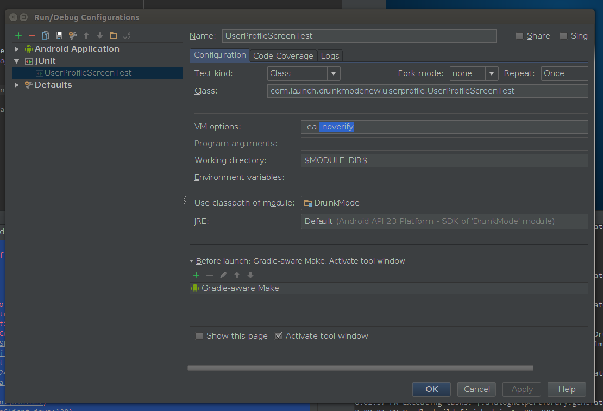

# Robolectric
## 为啥要用Robolectric
们知道安卓的app需要运行在delvik上面，我们开发Android app是在JVM上面，在开发之前我们需要下载各个API-level的SDK的，下载的每个SDK都有一个android.jar的包，这些可以在你的androidsdkhome/platforms/下面看到。当我们开发一个项目的时候，我们需要指定一个API-level，其实就是将对应的android.jar 加到这个项目的build path里面去。这样我们的项目就可以编译打包了。然而现在的问题是，我们的代码必须运行在emulator或者是device上面，说白了，就是我们的IDE和SDK只提供了开发和编译一个项目的环境，并没有提供运行这个项目的环境，原因是因为android.jar里面的class实现是不完整的，它们只是一些stub，如果你打开android.jar下面的代码去看看，你会发现所有的方法都只有一行实现：
```throw RuntimeException("stub!!");```
 
而运行unit test，说白了还是个运行的过程，所以如果你的unit test代码里面有android相关的代码的话，那运行的时候将会抛出RuntimeException("stub!!")。为了解决这个问题，现在业界提出了很多不同的程序架构，比如MVP、MVVM等等，这些架构的优势之一，就是将其中一层抽出来，变成pure Java实现，这样做unit testing就不会遇到上面这个问题了，因为其中没有android相关的代码。
好奇的童鞋可能会问了，既然android.jar的实现是不完整的，那为什么我们可以编译这个项目呢？那是因为编译代码的过程并没有真正的运行这些代码，它只会检查你的接口有没有定义，以及其他的一些语法是不是正确。举个简单的例子：
```
    public class Test {
        public static void main(String[] argv) {
            testMethod();
        }
        public static void testMethod() {
            throw RuntimeException("stub!!");
        }
    }
```
上面的代码你同样可以编译通过，但你运行的时候，就会抛出异常RuntimeException("stub!!")。当我们的项目运行在emulator或者是device上面的时候，android.jar被替换成了emulator或者是device上面的系统的实现，那上面的实现是真正实现了那些方法的，所以运行起来没有问题。
 
解决的办法就是使用一个开源的framework，叫robolectric，他们的做法是通过实现一套JVM能运行的Android代码，然后在unit test运行的时候去截取android相关的代码调用，然后转到他们的他们实现的代码去执行这个调用的过程。举个例子说明一下，比如android里面有个类叫TextView，他们实现了一个类叫ShadowTextView。这个类基本上实现了TextView的所有公共接口，假设你在unit test里面写到
String text = textView.getText().toString();。在这个unit test运行的时候，Robolectric会自动判断你调用了Android相关的代码textView.getText()，然后这个调用过程在底层截取了，转到ShadowTextView的getText实现。而ShadowTextView是真正实现了getText这个方法的，所以这个过程便可以正常执行。


 