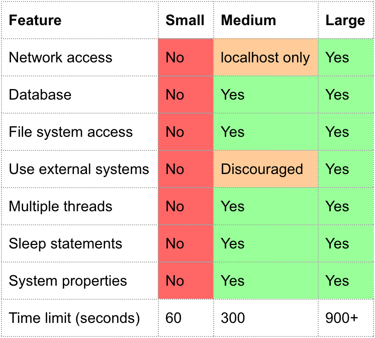
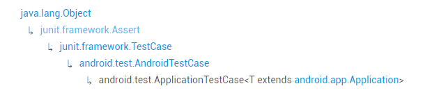
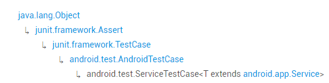
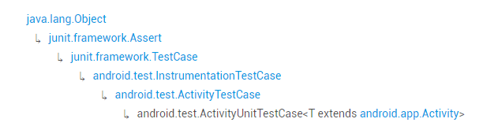
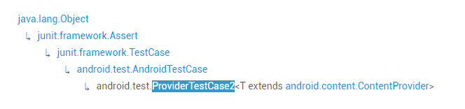
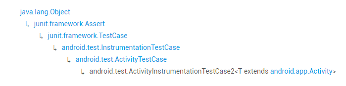
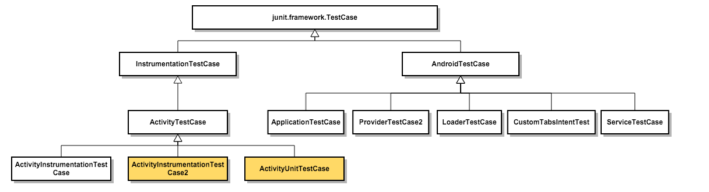
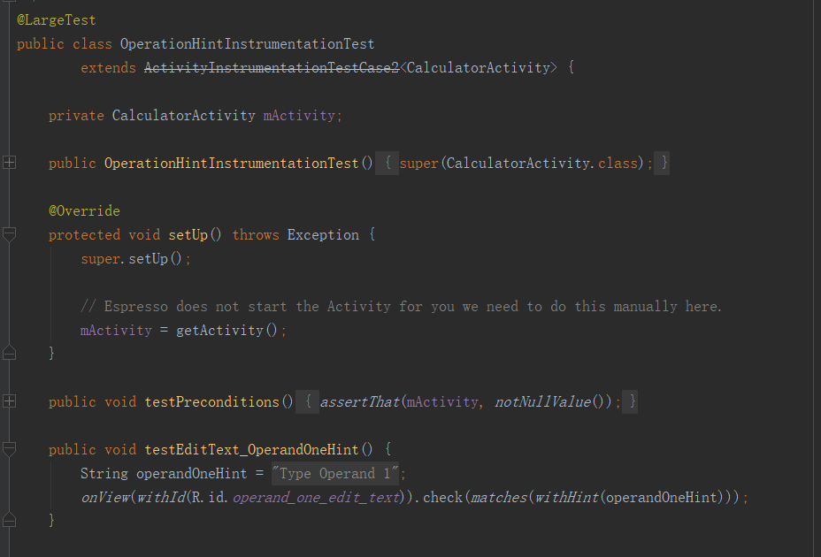
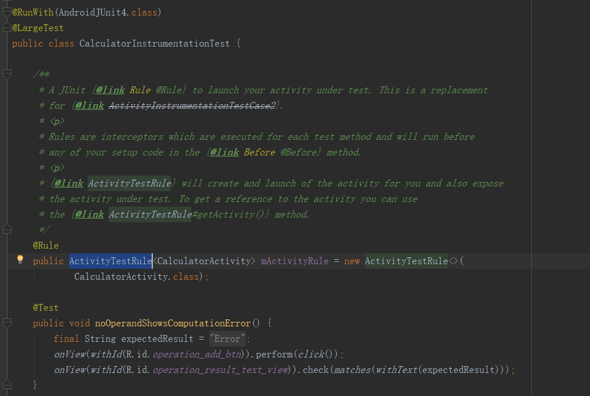
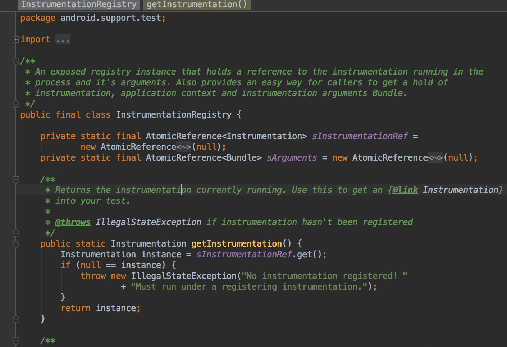

# 测试基础。

@smallTest,@MediumTest,@LargeTest

@UIThreadTest

@suppress 标记后改测试用例从测试集合中排除

 

# 测试套件，把几个测试类包起来一起测试

```

@RunWith(Suite.class)
@Suite.SuiteClasses({CalculatorTest.class, CalculatorAddParameterizedTest.class})
public class UnitTestSuite {}
```

# 用命令来执行测试用例

* gradle

./gradlew test

./gradlew connectedAndroidTest

./gradlew mylibrary:connectedAndroidTest

单行测试失败将导致真个测试任务失败。这意味着并不是所有的测试都会执行。如果你希望这个测试单元在所有的构建变体上都被执行，添加continue标识：

$ gradlew test --continue


如果你不想运行整个测试单元，只想测试某个类，可以添加标识：

$ gradlew testDebug --tests="*.LogicTest"

* am instrument
am instrument [flags]  test_package test_package/runner_class
-r 打印原始结果
-e <N><V> 设置参数
-p<F> 存档保存到外部文件
-w 等等设备结束后退出

运行一个包中所有用例
adb shell am instrument -w com.example.android.notepad.NotePadTest/android.support.test.runner.AndroidJUnitRunner

运行一个类中所有用例
adb shell am instrument -w -e class com.example.android.notepad.NotePadTest com.example.android.notepad.test/android.support.test.runner.AndroidJUnitRunner

运行一个类中的testAddNote用例
adb shell am instrument -w -e class com.example.android.notepad.NotePadTest com.example.android.notepad.test#testAddNote/android.support.test.runner.AndroidJUnitRunner


运行一个类中的small标签的用例
adb shell am instrument -w -e size small class com.example.android.notepad.NotePadTest com.example.android.notepad.test/android.support.test.runner.AndroidJUnitRunner

运行一个suite的用例
adb shell am instrument -w  -e class com.example.android.testing.androidjunitrunnersample.suite.UnitTestSuite com.example.android.testing.androidjunitrunnersample.test/android.support.test.runner.AndroidJUnitRunner


#测试基类
* TestCase
* InstrumentttionTestCase
* AndroidTestCase
ActivityInstrumenttionTestCase2,ProvideTestCase2,ServiceTestCase,ApplicationTestCase







# Android的测试框架相关的API主要定义在三个包中：
android.test 用于编写Android测试用例
android.test.mock 定义了方便测试用的测试“桩”类
android.test.suitebuilder 运行测试用例的Test Runner类
Android 测试API 是基于JUnit 扩展而来，并添加了与Android平台相关的测试API。

# Test case 相关类

Android提供了多个由Testcase或Assert派生而来的子类以支持Android平台相关的setup,teardown 和其它辅助方法。

AndroidTestCase 为一Android平台下通用的测试类，它支持所有JUnit的Assert方法和标准的setUp 和tearDown 方法，并可以用来测试Android permission 。
组件相关的测试类如测试activity, Content provider ,Service 相关的测试类，Android没有提供单独的用来测试BroadcastReceiver 的测试类，而是可以通过发送Intent对象来检测Broadcast Receiver的反应结果来测试BroadcastReceiver。
InstrumentationTestCase 如果你要使用Instrumentation API，那么你必须使用InstrumentationTestCase或其子类。

# Activity测试
Activity的测试非常依赖于Android的Instrumation 框架，和Android其他组件不同的是，Activity具有复杂的生命周期回调函数(如onCreate, onStart 等) ，通常情况下除通过Instrumation 接口外不能直接调用这些回调函数。

测试Activity的基本测试类为InstrumentationTestCase,它提供了Instrumentation接口给TestCase的子类。 为了支持Activity测试，InstrumentationTestCase提供了下面功能：
生命周期控制： 使用Instrumentation，你可以启动，暂停，中止被测试的Activity。
Dependency Injection : Instrumentation允许创建一些Mock对象如Context，Application来帮助测试Activity，从而帮助你控制测试环境并和实际的应用的其他部分隔离开来。你也可以定制一些Intent以启动Activity。
用户界面交互： 你可以使用Instrumentation向UI发送按键和触摸事件。
下面几个为主要的用于测试Activity由TestCase派生而来的测试类：

* ActivityInstrumentationTestCase2 主要用来测试一个或多个 Activity 的功能测试，使用和最终应用同样的运行环境来测试 Activity 的功能。可以使用正常系统 Context (非 Mock）来测试 Activity 的功能。 并允许你创建一些 Mock Intent 用来测试 Activity 的响应。要注意的是，这种 TestCase 不允许使用 Mock 的 Context 和 Application 对象测试，也就是说你必须使用和应用程序实际运行的环境来测试。

* ActivityUnitTestCase 通常用来测试单独 Activity。在启动被测试的 Activity 之前，你可以 Inject 一个假的 Context 或是 Application ，使用这个 Mock 的 Context 中一个隔离环境中运行被测试的 Activity。通常用于 Activity 的单元测试，而不和 Anroid 系统进行交互。


 
# ApplicationTestCase 

主要用来测试Application 类，提供了对Application类生命周期方法的基本支持，并可以支持一些dependency injection 以帮助构造测试Application的的环境。

Application Lifecycle 支持， 每个Application运行 都遵循一定的顺序（生命周期方法），ApplicationTestCase提供下面方法来支持对Application生命周期方法的测试：

只有当测试用例调用createApplication()后才会执行Application 的onCreate 方法，从而使得你有机会在调用Application的onCreate方法之前对测试框架做些调整。
当测试用例结束时，测试用例的tearDown 方法会被调用，然后会调用Application 的onDestroy()方法停止和销毁Application.

# AndroidJUnitRunner @RunWith(AndroidJUnit4.class)
AndroidJUnitRunner是Instrumentation的子类，用来替代InstrumentationTestRunner.
AndroidJUnitRunner 类是一个 JUnit 测试运行器，可让您在 Android 设备上运行 JUnit 3 或 JUnit 4 样式测试类，包括使用 Espresso 和 UI Automator测试框架的设备。测试运行器可以将测试软件包和要测试的应用加载到设备、运行测试并报告测试结果。此类将替换 InstrumentationTestRunner 类，后者仅支持 JUnit 3 测试。
此测试运行器的主要功能包括：
* JUnit 支持
* 访问仪器信息
* 测试筛选
* 测试分片
要求 Android 2.2（API 级别 8）或更高版本。

 
## 访问仪器信息
您可以使用 InstrumentationRegistry 类访问与测试运行相关的信息。此类包括 Instrumentation 对象、目标应用 Context 对象、测试应用 Context 对象，以及传递到测试中的命令行参数。使用 UI Automator 框架编写测试或编写依赖于 Instrumentation 或 Context 对象的测试时，此数据非常有用。

## 测试筛选
在 JUnit 4.x 测试中，您可以使用注解对测试运行进行配置。此功能可将向测试中添加样板文件和条件代码的需求降至最低。除了 JUnit 4 支持的标准注解外，测试运行器还支持 Android 特定的注解，包括：

@RequiresDevice：指定测试仅在物理设备而不在模拟器上运行。
@SdkSupress：禁止在低于给定级别的 Android API 级别上运行测试。例如，要禁止在低于 18 的所有 API 级别上运行测试，请使用注解 @SDKSupress(minSdkVersion=18)。
@SmallTest、@MediumTest 和 @LargeTest：指定测试的运行时长以及运行频率。


# Instrument
官方说明
Instrumentation类位于android.app包中，继承自java.lang.Object，一些测试用类如InstrumentationTestRunner或MultiDexTestRunner直接或间接继承自该类。官方对于该类的解释如下：

Base class for implementing application instrumentation code. When running with instrumentation turned on, this class will be instantiated for you before any of the application code, allowing you to monitor all of the interaction the system has with the application. An Instrumentation implementation is described to the system through an AndroidManifest.xml’s instrumentation tag.

大意是当instrumentation开启的话，它会在应用程序的任何组件创建之前初始化，可以用来监控系统与应用的所有交互。系统可以根据AndroidManifest.xml中的 instrumentation 标签来实现instrumentation。


Activity的启动会在ActivityThread—>handleLaunchActivity()
```
private Activity performLaunchActivity(ActivityClientRecord r, Intent customIntent) {
    // System.out.println("##### [" + System.currentTimeMillis() + "] ActivityThread.performLaunchActivity(" + r + ")");

  // 从ActivityClientRecord中得到待启动的Activity组件的信息
    ActivityInfo aInfo = r.activityInfo;
    if (r.packageInfo == null) {
        r.packageInfo = getPackageInfo(aInfo.applicationInfo, r.compatInfo,
                Context.CONTEXT_INCLUDE_CODE);
    }

    ComponentName component = r.intent.getComponent();
    if (component == null) {
        component = r.intent.resolveActivity(
            mInitialApplication.getPackageManager());
        r.intent.setComponent(component);
    }

    if (r.activityInfo.targetActivity != null) {
        component = new ComponentName(r.activityInfo.packageName,
                r.activityInfo.targetActivity);
    }
// 通过Instrumentation的newActivity方法来创建Activity对象
    Activity activity = null;
    try {
        java.lang.ClassLoader cl = r.packageInfo.getClassLoader();
        activity = mInstrumentation.newActivity(
                cl, component.getClassName(), r.intent);
        StrictMode.incrementExpectedActivityCount(activity.getClass());
        r.intent.setExtrasClassLoader(cl);
        r.intent.prepareToEnterProcess();
        if (r.state != null) {
            r.state.setClassLoader(cl);
        }
    } catch (Exception e) {
        if (!mInstrumentation.onException(activity, e)) {
            throw new RuntimeException(
                "Unable to instantiate activity " + component
                + ": " + e.toString(), e);
        }
    }

    try {
      // 创建Application
        Application app = r.packageInfo.makeApplication(false, mInstrumentation);

        if (localLOGV) Slog.v(TAG, "Performing launch of " + r);
        if (localLOGV) Slog.v(
                TAG, r + ": app=" + app
                + ", appName=" + app.getPackageName()
                + ", pkg=" + r.packageInfo.getPackageName()
                + ", comp=" + r.intent.getComponent().toShortString()
                + ", dir=" + r.packageInfo.getAppDir());

        if (activity != null) {
            Context appContext = createBaseContextForActivity(r, activity);
            CharSequence title = r.activityInfo.loadLabel(appContext.getPackageManager());
            Configuration config = new Configuration(mCompatConfiguration);
            if (r.overrideConfig != null) {
                config.updateFrom(r.overrideConfig);
            }
            if (DEBUG_CONFIGURATION) Slog.v(TAG, "Launching activity "
                    + r.activityInfo.name + " with config " + config);
            Window window = null;
            if (r.mPendingRemoveWindow != null && r.mPreserveWindow) {
                window = r.mPendingRemoveWindow;
                r.mPendingRemoveWindow = null;
                r.mPendingRemoveWindowManager = null;
            }
          // 调用Activity的attach方法
            activity.attach(appContext, this, getInstrumentation(), r.token,
                    r.ident, app, r.intent, r.activityInfo, title, r.parent,
                    r.embeddedID, r.lastNonConfigurationInstances, config,
                    r.referrer, r.voiceInteractor, window);

            if (customIntent != null) {
                activity.mIntent = customIntent;
            }
            r.lastNonConfigurationInstances = null;
            activity.mStartedActivity = false;
            int theme = r.activityInfo.getThemeResource();
            if (theme != 0) {
                activity.setTheme(theme);
            }

            activity.mCalled = false;
            if (r.isPersistable()) {
                mInstrumentation.callActivityOnCreate(activity, r.state, r.persistentState);
            } else {
                mInstrumentation.callActivityOnCreate(activity, r.state);
            }
            if (!activity.mCalled) {
                throw new SuperNotCalledException(
                    "Activity " + r.intent.getComponent().toShortString() +
                    " did not call through to super.onCreate()");
            }
            r.activity = activity;
            r.stopped = true;
            if (!r.activity.mFinished) {
                activity.performStart();
                r.stopped = false;
            }
            if (!r.activity.mFinished) {
                if (r.isPersistable()) {
                    if (r.state != null || r.persistentState != null) {
                        mInstrumentation.callActivityOnRestoreInstanceState(activity, r.state,
                                r.persistentState);
                    }
                } else if (r.state != null) {
                    mInstrumentation.callActivityOnRestoreInstanceState(activity, r.state);
                }
            }
            if (!r.activity.mFinished) {
                activity.mCalled = false;
                if (r.isPersistable()) {
                    mInstrumentation.callActivityOnPostCreate(activity, r.state,
                            r.persistentState);
                } else {
                    mInstrumentation.callActivityOnPostCreate(activity, r.state);
                }
                if (!activity.mCalled) {
                    throw new SuperNotCalledException(
                        "Activity " + r.intent.getComponent().toShortString() +
                        " did not call through to super.onPostCreate()");
                }
            }
        }
        r.paused = true;

        mActivities.put(r.token, r);

    } catch (SuperNotCalledException e) {
        throw e;

    } catch (Exception e) {
        if (!mInstrumentation.onException(activity, e)) {
            throw new RuntimeException(
                "Unable to start activity " + component
                + ": " + e.toString(), e);
        }
    }

    return activity;
}

```
上述代码主要做了4件事情：

* 从ActivityClientRecord中得到待启动的Activity组件的信息
*通过Instrumentation的newActivity方法来创建Activity对象
* 创建Application对象
* 调用新启动Activity的attach方法上述代码主要做了4件事情：
Instrumentation的newActivity的实现：
```
/**
* Perform instantiation of the process's {@link Activity} object.  The
* default implementation provides the normal system behavior.
* 
* @param cl The ClassLoader with which to instantiate the object.
* @param className The name of the class implementing the Activity
*                  object.
* @param intent The Intent object that specified the activity class being
*              instantiated.
* 
* @return The newly instantiated Activity object.
*/
public Activity newActivity(ClassLoader cl, String className,
        Intent intent)
        throws InstantiationException, IllegalAccessException,
        ClassNotFoundException {
    return (Activity)cl.loadClass(className).newInstance();
}
```
很简单，使用类加载器初始化一个Activity对象。
```

/**
* Perform instantiation of the process's {@link Application} object.  The
* default implementation provides the normal system behavior.
* 
* @param clazz The class used to create an Application object from.
* @param context The context to initialize the application with
* 
* @return The newly instantiated Application object.
*/
static public Application newApplication(Class<?> clazz, Context context)
        throws InstantiationException, IllegalAccessException, 
        ClassNotFoundException {
    Application app = (Application)clazz.newInstance();
    app.attach(context);
    return app;
}
```
同样，Application也是通过类加载器来创建是个实例对象。
之后调用Activity的attach方法，将上下文对象、window等附加到Activity上。
```
activity.attach(appContext, this, getInstrumentation(), r.token,
        r.ident, app, r.intent, r.activityInfo, title, r.parent,
        r.embeddedID, r.lastNonConfigurationInstances, config,
        r.referrer, r.voiceInteractor, window);
```

接下来就会调用mInstrumentation.callActivityOnCreate，在Instrumentation的一种重载方法为：

```        
/**
* Perform calling of an activity's {@link Activity#onCreate}
* method.  The default implementation simply calls through to that method.
*
* @param activity The activity being created.
* @param icicle The previously frozen state (or null) to pass through to onCreate().
*/
public void callActivityOnCreate(Activity activity, Bundle icicle) {
    prePerformCreate(activity);
    activity.performCreate(icicle);
    postPerformCreate(activity);
}
```
其中activity.performCreate(icicle)会调用到Activity中的对应方法：

```
final void performCreate(Bundle icicle) {
    restoreHasCurrentPermissionRequest(icicle);
    onCreate(icicle);
    mActivityTransitionState.readState(icicle);
    performCreateCommon();
}
```
其中onCreate(icicle)会触发Activity的onCreate生命周期回调

# ActivityThread中的Instrumentation是何时初始化的

在ActivityThread中搜索，发现有几处为mInstrumentation赋值的地方：

1.ActivityThread的attach方法，方法声明为：

```
private void attach(boolean system) {
  ……
}
```
当system参数为true时，会执行到如下为mInstrumentation赋值的代码：

```
try {
    mInstrumentation = new Instrumentation();
    ContextImpl context = ContextImpl.createAppContext(
            this, getSystemContext().mPackageInfo);
    mInitialApplication = context.mPackageInfo.makeApplication(true, null);
    mInitialApplication.onCreate();
} catch (Exception e) {
    throw new RuntimeException(
            "Unable to instantiate Application():" + e.toString(), e);
}
```
当Application创建完成之后，会调用如下代码：
instrumentation.callApplicationOnCreate(app);
查看位于Instrumentation的具体实现：
```
/**
* Perform calling of the application's {@link Application#onCreate}
* method.  The default implementation simply calls through to that method.
*
* <p>Note: This method will be called immediately after {@link #onCreate(Bundle)}.
* Often instrumentation tests start their test thread in onCreate(); you
* need to be careful of races between these.  (Well between it and
* everything else, but let's start here.)
*
* @param app The application being created.
*/
public void callApplicationOnCreate(Application app) {
    app.onCreate();
}
```
最终调用app.onCreate()从而触发Application的onCreate生命周期回调
在主线程ActivityThread的main方法中system参数为false，故此时没有创建Instrumentation对象：

```
ActivityThread thread = new ActivityThread();
thread.attach(false);
```
2.ActivityThread的handleBindApplication(AppBindData data)方法中，有如下逻辑：

```
final InstrumentationInfo ii;
if (data.instrumentationName != null) {
    try {
        ii = new ApplicationPackageManager(null, getPackageManager())
                .getInstrumentationInfo(data.instrumentationName, 0);
    } catch (PackageManager.NameNotFoundException e) {
        throw new RuntimeException(
                "Unable to find instrumentation info for: " + data.instrumentationName);
    }

    mInstrumentationPackageName = ii.packageName;
    mInstrumentationAppDir = ii.sourceDir;
    mInstrumentationSplitAppDirs = ii.splitSourceDirs;
    mInstrumentationLibDir = getInstrumentationLibrary(data.appInfo, ii);
    mInstrumentedAppDir = data.info.getAppDir();
    mInstrumentedSplitAppDirs = data.info.getSplitAppDirs();
    mInstrumentedLibDir = data.info.getLibDir();
} else {
    ii = null;
}

if (ii != null) {
    final ApplicationInfo instrApp = new ApplicationInfo();
    ii.copyTo(instrApp);
    instrApp.initForUser(UserHandle.myUserId());
    final LoadedApk pi = getPackageInfo(instrApp, data.compatInfo,
            appContext.getClassLoader(), false, true, false);
    final ContextImpl instrContext = ContextImpl.createAppContext(this, pi);

    try {
        final ClassLoader cl = instrContext.getClassLoader();
        mInstrumentation = (Instrumentation)
            cl.loadClass(data.instrumentationName.getClassName()).newInstance();
    } catch (Exception e) {
        throw new RuntimeException(
            "Unable to instantiate instrumentation "
            + data.instrumentationName + ": " + e.toString(), e);
    }

    final ComponentName component = new ComponentName(ii.packageName, ii.name);
    mInstrumentation.init(this, instrContext, appContext, component,
            data.instrumentationWatcher, data.instrumentationUiAutomationConnection);

    if (mProfiler.profileFile != null && !ii.handleProfiling
            && mProfiler.profileFd == null) {
        mProfiler.handlingProfiling = true;
        final File file = new File(mProfiler.profileFile);
        file.getParentFile().mkdirs();
        Debug.startMethodTracing(file.toString(), 8 * 1024 * 1024);
    }
} else {
    mInstrumentation = new Instrumentation();
}
```

当data.instrumentationName不为null时，即必须在AndroidManifest.xml中声明了Instrumentation标签才行，否则不会执行，此时会构造一个InstrumentationInfo对象ii，接下来会使用类加载器构造一个Instrumentation实例。

如果AndroidManifest.xml中没有声明Instrumentation标签，即data.instrumentationName为null时，则直接通过new来创建一个Instrumentation实例：

```
mInstrumentation = new Instrumentation();
```
一般应用都会在ActivityThread启动后，通过此方式创建Instrumentation的实例，该行为在应用其他组件创建之前。在一个应用进程中，各个Activity中的Instrumentation都是由ActivityThread传入的，它们归根溯源是同一个。

# 再看AndroidJUnitRunner

```
/**
* Sets up lifecycle monitoring, and argument registry.
* <p>
* Subclasses must call up to onCreate(). This onCreate method does not call start()
* it is the subclasses responsibility to call start if it desires.
* </p>
*/
@Override
public void onCreate(Bundle arguments) {
Log.i(LOG_TAG, "Instrumentation Started!");
logUncaughtExceptions();

installMultidex();

InstrumentationRegistry.registerInstance(this, arguments);
ActivityLifecycleMonitorRegistry.registerInstance(mLifecycleMonitor);
ApplicationLifecycleMonitorRegistry.registerInstance(mApplicationMonitor);
IntentMonitorRegistry.registerInstance(mIntentMonitor);

mHandlerForMainLooper = new Handler(Looper.getMainLooper());
mMainThread = Thread.currentThread();
final int corePoolSize = 0;
final long keepAliveTime = 0L;
mExecutorService = new ThreadPoolExecutor(corePoolSize, Integer.MAX_VALUE, keepAliveTime,
TimeUnit.SECONDS, new SynchronousQueue<Runnable>(), new ThreadFactory() {
@Override
public Thread newThread(Runnable runnable) {
Thread thread = Executors.defaultThreadFactory().newThread(runnable);
thread.setName(MonitoringInstrumentation.class.getSimpleName());
return thread;
}
});
Looper.myQueue().addIdleHandler(mIdleHandler);
super.onCreate(arguments);
specifyDexMakerCacheProperty();
setupDexmakerClassloader();
}/**

```
# 一个App的程序入口到底是什么？
是ActivityThread.main()。
# 整个App的主线程的消息循环是在哪里创建的？
是在ActivityThread初始化的时候，就已经创建消息循环了，所以在主线程里面创建Handler不需要指定Looper，而如果在其他线程使用Handler，则需要单独使用Looper.prepare()和Looper.loop()创建消息循环。
```

public static void main(String[] args) {

 ...ignore some code... 

   

Looper.prepareMainLooper();

ActivityThread thread = new ActivityThread();

thread.attach(false);

if (sMainThreadHandler == null) {

sMainThreadHandler = thread.getHandler();

}

AsyncTask.init();

if (false) {

Looper.myLooper().setMessageLogging(new

LogPrinter(Log.DEBUG, "ActivityThread"));

}

Looper.loop();


...ignore some code...    


}

```

也是在ActivityThread.main()的时候，再具体点呢，就是在thread.attach(false)的时候。


AMS是董事会，负责指挥和调度的，ActivityThread是老板，虽然说家里的事自己说了算，但是需要听从AMS的指挥，而Instrumentation则是老板娘，负责家里的大事小事，但是一般不抛头露面，听一家之主ActivityThread的安排。

# 基于instrumentation的测试框架Robotium,Expresso.


Robotium原理：

```
public Solo(Instrumentation instrumentation, Activity activity) {
this(new Solo.Config(), instrumentation, activity);
if(this.config.commandLogging) {
Log.d(this.config.commandLoggingTag, "Solo(" + instrumentation + ", " + activity + ")");
}


```
Expresso原理：

BaseLayerModule.java
```
@Provides
  FailureHandler provideFailureHandler(FailureHandlerHolder holder) {
    return holder.get();
  }

  @Provides
  @Default
  FailureHandler provideFailureHander() {
    return new DefaultFailureHandler(InstrumentationRegistry.getTargetContext());
  }
  
  @Provides @Singleton @MainThread
  public Executor provideMainThreadExecutor(Looper mainLooper) {
    final Handler handler = new Handler(mainLooper);
    return new Executor() {
      @Override
      public void execute(Runnable runnable) {
        handler.post(runnable);
      }
    };
  }

```
通用的流程：findView,操作，验证。
webview元素测试的原理：
```
    private boolean executeJavaScriptFunction(final String function){
        final WebView webView = viewFetcher.getFreshestView(viewFetcher.getCurrentViews(WebView.class, true));

        if(webView == null){
            return false;
        }
                //做一些JS注入执行前的准备工作，例如将WebView设为可允许执行JS等，并将RobotiumWeb.js中的脚本以String形式返回
        final String javaScript = prepareForStartOfJavascriptExecution();

        activityUtils.getCurrentActivity(false).runOnUiThread(new Runnable() {
            public void run() {
                if(webView != null){
                    webView.loadUrl("javascript:" + javaScript + function);
                }
            }
        });
        return true;
    }
```

